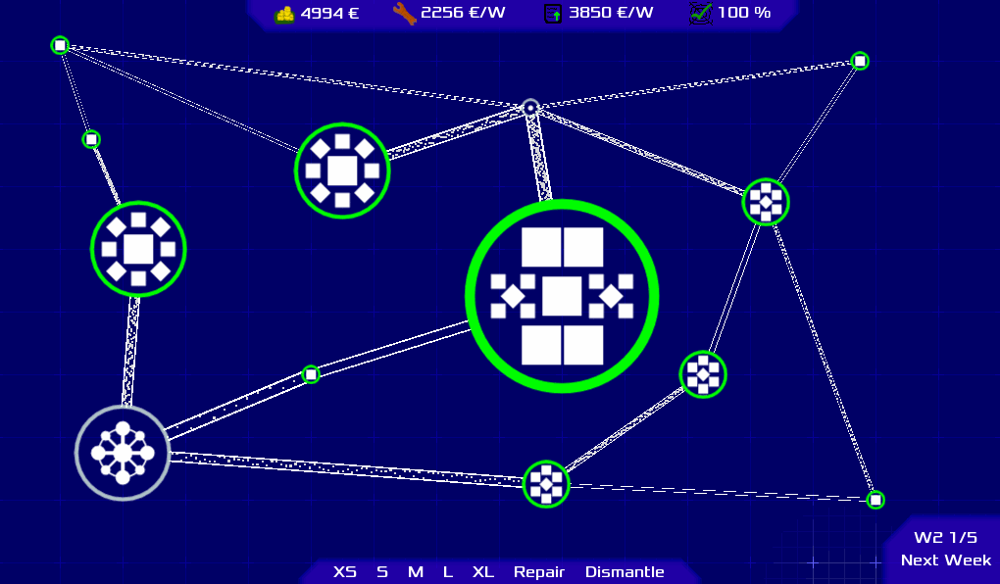

# Internet construction game

Your task is to develop and maintain a fully fledged cable network.

## Warning
This is a test. I never open sources a prototype before. It was initally developed in a series of streams on twitch and is therefor messy.

This repo uses [git lfs](https://git-lfs.github.com/)!

## Installation

1. Download [Godot 3.2.x](https://godotengine.org/download)
2. Install [git lfs](https://git-lfs.github.com/)
3. Clone repo
4. Import project in Godot

## License
[LICENSE](LICENSE) is applied to all files except third-party files:
 * ui/coin.wav CC0
 * Shader snippets where linked